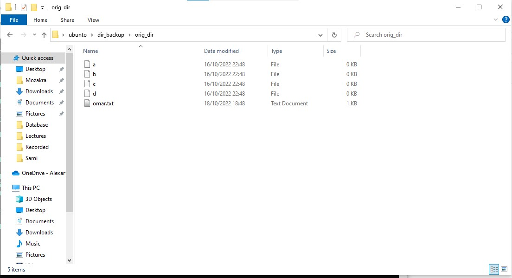
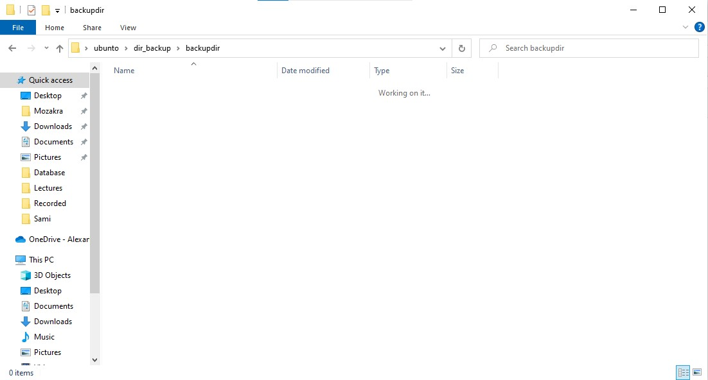
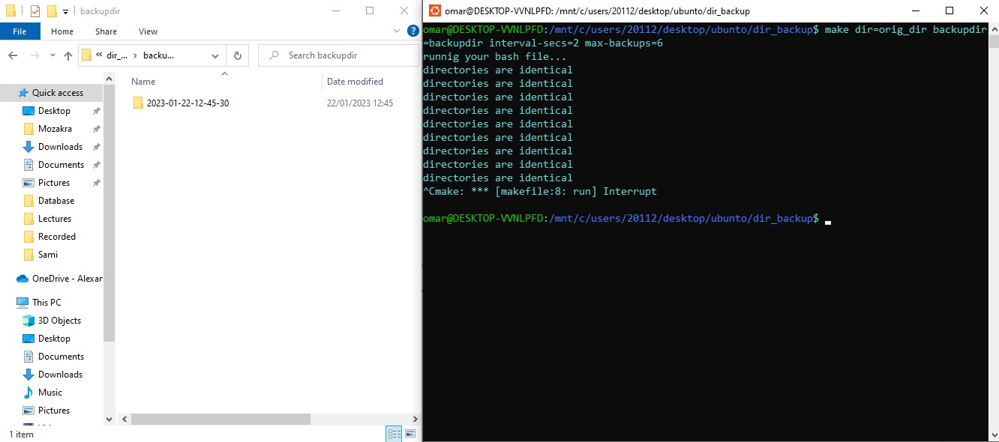
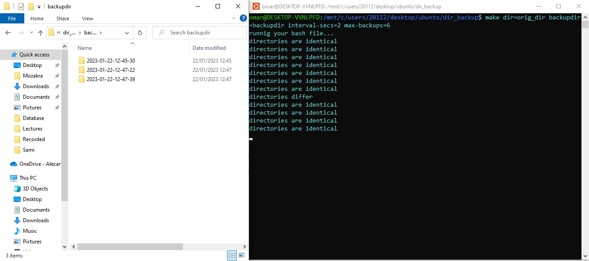

# Automatic-Directory-Backup
Project that compares two directories, and original directory and a backup directory, whenever a change happens in the original directory, it's automatically reflected in the backup directory.

### User Manual
open command line
go to specified directory
ex:
-> cd Downloads/dir_backup
to go to the dir that has our makefile and bashcript file.

then type the following:
-> make dir=<dir to be recovered> backupdir=<dir in which to recover> interval-secs=<time in secs to periodically recover> max-backups=<max number of files to be kept>
ex:
make dir=orig_dir backupdir=backupdir interval-secs=2 max-backups=6

### Now lets look at our original directory

### Lets look at the initially empty backup directory

### Lets run the program

### what if we make changes in the original directory

## Adding a Cronjob
### Overview
in this part we make a cron job to completely automate the process without letting the terminal run forever.
since the cron job runs every minute we don't need to have the inertval-secs parameter, and we don't need to go into an infinite loop instead, everytime we old file with the new file if they differ then backup the directory like explained above and update old file.

logs.txt simply changes every minute and tells us if the directories are exact or different.
### what you need to know
we have dir path that we check on as:
dir_backup/orig_dir
and the backup path as:
dir_backup/backupdir
as well as the max number backups=5
if you want feel free to change the parameters in the beginning of the bash file it's up to you.
 
## Requirements:
1-make sure that the bash file is in this directory dir_backup/backupd_cronjobs.sh
or you can modify the directory and modify step 3
2-open command line and type:
$ crontab -e

3-paste this at the end of the file that opens
\* \* \* \* \* /bin/bash dir_backup/backupd_cronjobs.sh

4-press control+s to save
5-press control+x to exit

### To install cron
open the terminal and type the following to install cron
apt-get install cron

after installing cron refer to a) to configure the file
